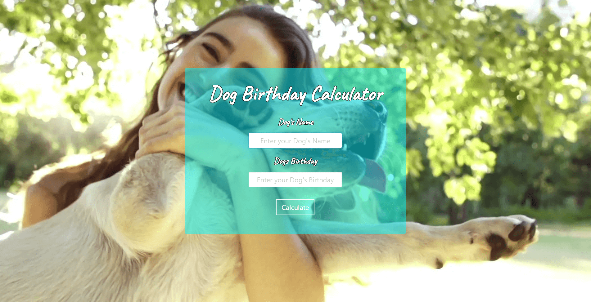

# 🐕 Dog Birthday Calculator

[](https://aldi.github.io/dog-birthday-calculator)
[](https://react.dev)
[](https://bulma.io)

Calculate your dog's upcoming birthdays in "dog years" (7 human weeks = 1 dog year).

**[🚀 Try the Live Demo](https://aldi.github.io/dog-birthday-calculator)**



## ✨ Features

- 📅 Enter your dog's name and date of birth
- 🎂 Get the next 7 upcoming "dog birthdays"
- 🎬 Smooth animations with Framer Motion
- 📱 Fully responsive design
- 🎥 Beautiful video background

## 🛠️ Tech Stack

- **React 18** - Modern UI library
- **Bulma 1.0** - CSS framework
- **Framer Motion 11** - Animations
- **Day.js** - Date formatting

## 🚀 Quick Start

```bash
# Install dependencies
npm install

# Run development server
npm start

# Build for production
npm run build

# Deploy to GitHub Pages
npm run deploy
```

## 📁 Project Structure

```
src/
├── App.js                 # Main app component
├── App.css                # Custom styles
├── components/
│   ├── BackgroundVideo.js # Video background
│   └── Birthdays.js       # Birthday list display
└── utils/
    ├── animations.js      # Shared Framer Motion variants
    └── calculateBirthdays.js # Birthday calculation logic
```

## 📄 License

MIT © [Aldi Duzha](https://github.com/aldi)
